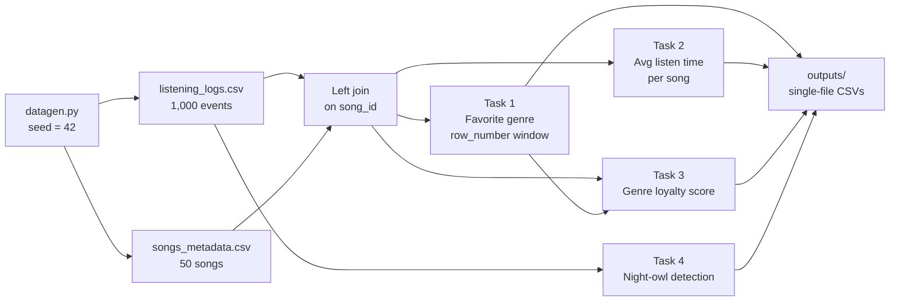

## PySpark user listening behavior analytics: deterministic row_number ranking, genre loyalty

A batch analytics pipeline built on the Apache Spark DataFrame API. It analyzes how users listen: which genre each user favors, how concentrated their listening is in that genre, how long listeners stay on each track, and which users listen mostly late at night. The input is a reproducible, seeded synthetic event log of 1,000 listening events from 100 users across 50 songs, enriched with song metadata through a join.

---

## Architecture



| Stage | Implementation |
|---|---|
| Ingestion | `spark.read.csv` with headers; `duration_sec` cast to `int`, `timestamp` parsed with `to_timestamp` |
| Enrichment | Left join of listening events (fact) to song metadata (dimension) on `song_id` |
| Ranking | `row_number()` over `Window.partitionBy("user_id").orderBy(plays DESC, genre ASC)` |
| Aggregation | `groupBy` with `count`, `avg`, and ratio columns |
| Time analysis | `hour()` extraction under a UTC session time zone |
| Output | One CSV per result set via `coalesce(1)`, written with `mode("overwrite")` |

### Design highlights

- **Deterministic top-1-per-group ranking.** `row_number()` guarantees exactly one favorite genre per user, and the secondary sort on `genre ASC` makes tie resolution reproducible. This matters in practice: **34 of the 100 users have two or more genres tied for most plays**. Without the tie-break, their favorite genre could change from run to run.
- **UTC-pinned event time.** `spark.sql.session.timeZone` is set to `UTC`, so timestamps are parsed and bucketed into hours exactly as recorded, whatever the machine's local time zone. The dataset includes an event at 02:xx on 2025-03-09, a local time that doesn't exist in US time zones observing daylight saving time. Pinning UTC keeps that event from being shifted, which would distort the 00:00–05:00 night window.
- **Explicit type casting.** CSV columns are read as strings and cast deliberately (`int` for durations, `timestamp` for event times), so no work is wasted on schema inference and no column ends up with an unexpected type.
- **Reproducible inputs.** The generator is seeded (`seed=42`), so every run produces identical data and identical results.
- **Parameterized execution.** Input and output locations are CLI arguments, and the night-owl thresholds (`min_night_plays`, `min_ratio`) are function parameters.

---

## Dataset

Both files are generated by `datagen.py`:

| Parameter | Value |
|---|---|
| Random seed | 42 |
| Users | 100 (`user_1` … `user_100`) |
| Songs | 50 (`song_1` … `song_50`) |
| Listening events | 1,000 (about 10 per user; min 4, max 18) |
| Time range | 2025-03-01 to 2025-03-27 |
| Listen duration | 30 to 300 seconds, uniformly random |
| Genres | Pop, Rock, Jazz, Classical, Hip-Hop |
| Moods | Happy, Sad, Energetic, Chill |
| Artists | 20 (`Artist_1` … `Artist_20`) |

### `listening_logs.csv` (fact table)

| Column | Type | Description |
|---|---|---|
| `user_id` | string | User identifier |
| `song_id` | string | Song played |
| `timestamp` | timestamp | Play time, `yyyy-MM-dd HH:mm:ss` |
| `duration_sec` | int | Seconds listened |

### `songs_metadata.csv` (dimension table)

| Column | Type | Description |
|---|---|---|
| `song_id` | string | Song identifier |
| `title` | string | Track title |
| `artist` | string | Performing artist |
| `genre` | string | Genre |
| `mood` | string | Mood tag |

Song counts by genre: Classical 13, Rock 11, Jazz 11, Hip-Hop 8, Pop 7.

---

## Repository Structure

```
pyspark-listening-behavior-analytics/
├── datagen.py              # Seeded synthetic data generator
├── main.py                 # Spark pipeline: all four analyses
├── requirements.txt        # pyspark, pandas
├── README.md
├── inputs/                 # Generated by datagen.py
│   ├── listening_logs.csv
│   └── songs_metadata.csv
└── outputs/                # Generated by main.py
    ├── user_favorite_genres/
    ├── avg_listen_time_per_song/
    ├── genre_loyalty_scores/
    │   └── above_0_8/
    └── night_owl_users/
        ├── all_user_night_stats/
        └── frequent/
```

Spark writes each result as a directory containing one `part-*.csv` file, plus a `_SUCCESS` marker and `.crc` checksum files.

---

## Quickstart

### Prerequisites

- Python 3
- Java runtime (Spark runs on the JVM)
- `pyspark` and `pandas` (the pip `pyspark` package includes `spark-submit`, so no separate Spark install is needed)

```bash
pip install -r requirements.txt
```

### 1. Generate the input data

```bash
python3 datagen.py
```

### 2. Run the pipeline

```bash
spark-submit main.py --input_dir inputs --output_dir outputs
# or
python3 main.py --input_dir inputs --output_dir outputs
```

### 3. Inspect the results

```bash
ls -R outputs/
cat outputs/user_favorite_genres/part-*.csv
```

---

## Analyses and Results

All results below come from running the pipeline on the seeded dataset. Decimals are rounded for display; the CSVs contain full precision.

### Task 1: Favorite Genre per User

**Method:** join events to metadata, count plays per `(user_id, genre)`, then keep the top-ranked genre per user with `row_number()` over a window partitioned by user and ordered by `plays DESC, genre ASC`.

**Output:** `outputs/user_favorite_genres/` (100 rows)

| user_id | genre | plays |
|---|---|---:|
| user_1 | Pop | 4 |
| user_10 | Classical | 3 |
| user_100 | Jazz | 3 |
| user_11 | Hip-Hop | 4 |
| user_12 | Jazz | 8 |

Favorite genre distribution: Classical 41, Jazz 20, Hip-Hop 17, Rock 13, Pop 9.

### Task 2: Average Listen Time per Song

**Method:** group by `song_id`, `title`, `artist`, and `genre`, then compute `avg(duration_sec)`, sorted descending.

**Output:** `outputs/avg_listen_time_per_song/` (50 rows)

| song_id | title | artist | genre | avg_listen_time_sec |
|---|---|---|---|---:|
| song_19 | Title_song_19 | Artist_15 | Pop | 201.26 |
| song_11 | Title_song_11 | Artist_14 | Hip-Hop | 198.50 |
| song_43 | Title_song_43 | Artist_10 | Rock | 197.12 |
| song_16 | Title_song_16 | Artist_5 | Hip-Hop | 192.70 |
| song_44 | Title_song_44 | Artist_17 | Rock | 192.05 |

Per-song averages range from 127.27 s (`song_39`) to 201.26 s. The overall mean across all events is 168.53 s.

### Task 3: Genre Loyalty Score

**Definition:** `loyalty_score = fav_genre_plays / total_plays`, the share of a user's plays that fall in their favorite genre.

**Method:** compute total plays per user and plays per user-genre, join to the Task 1 favorites, compute the ratio, and filter for `loyalty_score > 0.8`.

**Output:** `outputs/genre_loyalty_scores/` (100 rows)

| user_id | fav_genre_plays | fav_genre | total_plays | loyalty_score |
|---|---:|---|---:|---:|
| user_39 | 4 | Hip-Hop | 5 | 0.800 |
| user_75 | 3 | Jazz | 4 | 0.750 |
| user_30 | 4 | Classical | 6 | 0.667 |
| user_28 | 4 | Classical | 6 | 0.667 |
| user_68 | 5 | Classical | 8 | 0.625 |

**Output:** `outputs/genre_loyalty_scores/above_0_8/` (**0 rows**). The highest score is exactly 0.80, and the filter is strict (`>`), so no user qualifies. Loyalty is low across the board (mean 0.393, median 0.364), as expected when each user's roughly 10 plays are spread at random across 5 genres.

### Task 4: Night-Owl Users

**Criteria:** a user is a night owl if they have at least **5 plays** between 00:00 (inclusive) and 05:00 (exclusive) **and** those plays make up at least **30%** of their total plays.

**Method:** extract `hour(timestamp)`, filter to hours 0–4, count night plays and total plays per user, join the two, and compute `night_ratio`.

**Output:** `outputs/night_owl_users/frequent/` (9 rows)

| user_id | night_plays | total_plays | night_ratio |
|---|---:|---:|---:|
| user_56 | 5 | 8 | 0.625 |
| user_43 | 5 | 9 | 0.556 |
| user_65 | 6 | 11 | 0.545 |
| user_94 | 6 | 12 | 0.500 |
| user_91 | 5 | 10 | 0.500 |
| user_11 | 5 | 11 | 0.455 |
| user_29 | 5 | 11 | 0.455 |
| user_87 | 5 | 15 | 0.333 |
| user_97 | 5 | 16 | 0.313 |

**Output:** `outputs/night_owl_users/all_user_night_stats/` (85 rows). Across the dataset, 21.9% of plays fall in the night window, close to the 20.8% (5 of 24 hours) expected from uniformly random timestamps.

---

## Analytical Notes

- **The tie-break shapes the genre results.** Because ties resolve alphabetically, Classical (first alphabetically) wins every tie it's part of. Classical also has the most songs (13 of 50), so both effects push it to 41 of 100 favorites. The tie-break guarantees reproducibility, not neutrality. Breaking ties by total listen time or most recent play would be a more meaningful rule.
- **The loyalty threshold doesn't fit this data.** With about 10 plays per user spread across 5 genres, a score above 0.8 is very unlikely, which is why `above_0_8/` is empty. On real data, where listening habits are much more skewed, the threshold would be more selective and more informative.
- **Night-owl thresholds need both conditions.** The minimum of 5 night plays filters out low-activity users whose ratio looks high only because they have few plays. For example, `user_28` has a 0.667 ratio but just 4 night plays, and is correctly excluded.

## Known Limitations

- **`all_user_night_stats` leaves out users with no night plays.** It's built with an inner join from night counts, so the 15 users with zero night plays are missing. Starting from total counts with a left join and filling missing values with 0 would make it cover all 100 users.
- **Strict loyalty threshold.** `> 0.8` excludes a user at exactly 0.80. Use `>= 0.8` if the boundary should count.
- **Lexicographic user ordering.** `user_id` is a string, so results sort as `user_1`, `user_10`, `user_100`, `user_11`. Sorting on the numeric suffix would give natural order.
- **Repeated computation.** The joined DataFrame feeds three tasks without `.cache()`, so Spark re-reads and re-joins the inputs for each output. Caching `joined` would avoid that.
- **Single-file output.** `coalesce(1)` produces one convenient CSV per result, but it routes all data through a single task, which doesn't scale to large outputs.

---

## Troubleshooting

| Symptom | Resolution |
|---|---|
| `ModuleNotFoundError: No module named 'pyspark'` | `pip install -r requirements.txt` |
| `ModuleNotFoundError: No module named 'pandas'` when running `datagen.py` | `pip install pandas` (included in `requirements.txt`) |
| `spark-submit: command not found` | Run `python3 main.py` instead, or add the pip-installed PySpark `bin/` directory to `PATH` |
| `JAVA_HOME is not set` or Java gateway errors | Install a Java runtime supported by your PySpark version |
| Can't find the output CSV | Each result is a directory; the data is in its `part-*.csv` file |

## References

- [Spark SQL, DataFrames and Datasets Guide](https://spark.apache.org/docs/latest/sql-programming-guide.html)
- [PySpark API Reference](https://spark.apache.org/docs/latest/api/python/)
